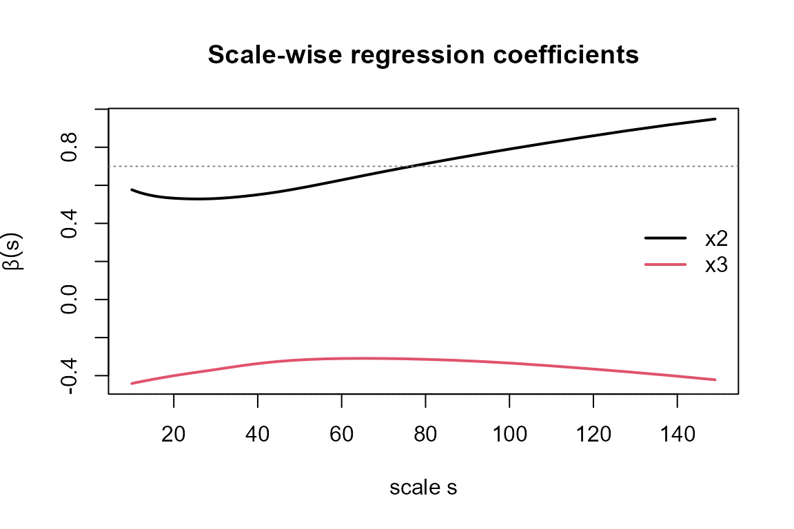

# Detrended fluctuation analysis and related methods

## Overview

Detrended Fluctuation Analysis (DFA) and its relatives are a family of
methods for measuring long-range correlations and cross-correlations in
**nonstationary** time series, where classical autocorrelation and
ordinary regression are biased by trends. `DFATools` collects the most
useful members of this family under a common, consistent interface:

| Concern | Function(s) |
|----|----|
| Scaling of a single series | [`dfa()`](https://ikarobarreto.github.io/DFATools/reference/dfa.md), [`plotdfa()`](https://ikarobarreto.github.io/DFATools/reference/plotdfa.md) |
| Cross-correlation of two series | [`rhodcca()`](https://ikarobarreto.github.io/DFATools/reference/rhodcca.md), [`plotrdcca()`](https://ikarobarreto.github.io/DFATools/reference/plotrdcca.md) |
| Partial cross-correlation | [`rhodpcca()`](https://ikarobarreto.github.io/DFATools/reference/rhodpcca.md) |
| Multiple cross-correlation | [`dmc2()`](https://ikarobarreto.github.io/DFATools/reference/dmc2.md) |
| Regression at each scale | [`betadfa()`](https://ikarobarreto.github.io/DFATools/reference/betadfa.md), [`sbdfa()`](https://ikarobarreto.github.io/DFATools/reference/sbdfa.md), [`fracreg()`](https://ikarobarreto.github.io/DFATools/reference/fracreg.md) |
| Scale-wise effect sizes | [`effsizeDFA()`](https://ikarobarreto.github.io/DFATools/reference/effsizeDFA.md) |
| Coefficient inference, diagnostics & robust SEs | [`fracreg()`](https://ikarobarreto.github.io/DFATools/reference/fracreg.md), [`fracreg.diag()`](https://ikarobarreto.github.io/DFATools/reference/fracreg.diag.md), [`fracreg.WB()`](https://ikarobarreto.github.io/DFATools/reference/fracreg.WB.md) |
| Significance tests | [`fracreg.PStest()`](https://ikarobarreto.github.io/DFATools/reference/fracreg.PStest.md), [`fracreg.Ktest()`](https://ikarobarreto.github.io/DFATools/reference/fracreg.Ktest.md), [`fracreg.IUTest()`](https://ikarobarreto.github.io/DFATools/reference/fracreg.IUTest.md) |

Several of the regression-oriented tools — the scale-dependent
**standardized** coefficients, the scale-wise $`f^2`$**effect size** and
the **intersection-union test** — were introduced by Barreto et al.
(2021), whose framework this package implements.

``` r
library(DFATools)
```

### Data convention and common arguments

Except for
[`dfa()`](https://ikarobarreto.github.io/DFATools/reference/dfa.md)
(which takes a single numeric vector), the functions expect a **matrix
or data frame whose first column is the response** $`Y`$ and whose
remaining columns are the covariates $`X_2, \dots, X_p`$. They share
four arguments:

- `dpo` — order of the polynomial used for detrending (1 = linear);
- `int` — if `TRUE`, the series are integrated (cumulatively summed)
  first;
- `np` — number of scales (box sizes) at which the statistics are
  evaluated;
- `overlap` — if `TRUE`, sliding (overlapping) boxes are used.

Throughout the vignette we use a simulated system in which a response
`y` depends on two random-walk drivers, `x2` (positive) and `x3`
(negative):

``` r
n  <- 1200
x2 <- cumsum(rnorm(n))
x3 <- cumsum(rnorm(n))
y  <- 0.7 * x2 - 0.5 * x3 + cumsum(rnorm(n))
dat <- data.frame(y = y, x2 = x2, x3 = x3)
```

## Detrended fluctuation analysis

DFA (Peng et al. 1994) quantifies the scaling of fluctuations in a
series. The series is first integrated into the profile
$`X(t) = \sum_{i=1}^{t} (x_i - \bar{x})`$, which is split into boxes of
size $`s`$; within each box a polynomial trend is removed and the
variance of the residuals is taken. Averaging over boxes gives the
**fluctuation function** $`F(s)`$, which for a self-similar series
follows a power law
``` math

F(s) \sim s^{\alpha},
```
where the exponent $`\alpha`$ generalises the Hurst exponent:
$`\alpha = 0.5`$ marks an uncorrelated series, $`\alpha > 0.5`$
persistence (long-range positive correlations) and $`\alpha < 0.5`$
anti-persistence.

``` r
fy <- dfa(dat$y, np = 40)
head(fy)
#> # A tibble: 6 × 2
#>       s     F
#>   <int> <dbl>
#> 1    10  3.81
#> 2    11  5.01
#> 3    12  6.43
#> 4    13  8.09
#> 5    14 10.0 
#> 6    15 12.2

# the DFA exponent is the slope of log F(s) against log s
alpha <- coef(lm(log10(fy$F) ~ log10(fy$s)))[[2]]
round(alpha, 3)
#> [1] 3.014
```

[`plotdfa()`](https://ikarobarreto.github.io/DFATools/reference/plotdfa.md)
draws the log–log fluctuation plot with the fitted exponent:

``` r
plotdfa(fy, main = "DFA of y")
```


## Cross-correlation: the rho-DCCA coefficient

Detrended Cross-Correlation Analysis (DCCA) (Podobnik and Stanley 2008)
replaces the box variance by the **detrended covariance**
$`F_{XY}^2(s)`$ between two integrated profiles. On its own
$`F_{XY}^2(s)`$ is unbounded, so Zebende (2011) normalised it into the
**DCCA cross-correlation coefficient**
``` math

\rho_{\mathrm{DCCA}}(s) = \frac{F_{XY}^2(s)}{F_X(s)\,F_Y(s)} \in [-1, 1],
```
a scale-by-scale analogue of Pearson’s correlation that is robust to
trends.
[`rhodcca()`](https://ikarobarreto.github.io/DFATools/reference/rhodcca.md)
returns one column per pair of series:

``` r
rc <- rhodcca(dat, np = 40)
head(rc)
#> # A tibble: 6 × 4
#>       s DCCA12 DCCA13  DCCA23
#>   <int>  <dbl>  <dbl>   <dbl>
#> 1    10  0.474 -0.372 -0.0361
#> 2    11  0.469 -0.370 -0.0353
#> 3    12  0.464 -0.368 -0.0332
#> 4    13  0.459 -0.367 -0.0305
#> 5    14  0.455 -0.364 -0.0278
#> 6    15  0.451 -0.362 -0.0252
```

``` r
plotrdcca(rc, var = "12")   # pair y (1) vs x2 (2)
```


The coefficient is strongly positive for the `y`–`x2` pair, as built
into the simulation.

## Partial cross-correlation: rho-DPCCA

When several series interact, a direct $`\rho_{\mathrm{DCCA}}`$ may be
inflated by shared drivers. Detrended Partial-Cross-Correlation Analysis
(Yuan et al. 2015) removes the linear influence of the remaining series
by inverting the $`\rho_{\mathrm{DCCA}}`$ matrix at each scale, giving
the **partial** coefficient $`\rho_{\mathrm{DPCCA}}(s)`$:

``` r
rp <- rhodpcca(dat, np = 40)
head(rp)
#> # A tibble: 6 × 4
#>       s DPCCA12 DPCCA13 DPCCA23
#>   <int>   <dbl>   <dbl>   <dbl>
#> 1    10   0.497  -0.403   0.171
#> 2    11   0.491  -0.401   0.169
#> 3    12   0.486  -0.399   0.167
#> 4    13   0.482  -0.397   0.167
#> 5    14   0.478  -0.395   0.166
#> 6    15   0.474  -0.393   0.166
```

## Multiple cross-correlation: DMC

The Detrended Multiple Cross-Correlation Coefficient (Zebende and Silva
Filho 2018) generalises the multiple-correlation coefficient ($`R`$) to
scales. Writing $`\boldsymbol{\rho}(s)`$ for the matrix of
$`\rho_{\mathrm{DCCA}}(s)`$ among the covariates and
$`\boldsymbol{\rho}_{Y\cdot}(s)`$ for their coefficients with the
response,
``` math

\mathrm{DMC}(s) = \boldsymbol{\rho}_{Y\cdot}(s)^{\top}\,
                  \boldsymbol{\rho}(s)^{-1}\,
                  \boldsymbol{\rho}_{Y\cdot}(s) \in [0, 1],
```
measuring how much of the response is jointly explained by the
covariates at each scale (a recent statistical test is given by Wang,
Xu, and Fan (2021)):

``` r
dm <- dmc2(dat, np = 40)
plot(dm[[1]], dm[[2]], type = "b", pch = 19, ylim = c(0, 1),
     xlab = "scale s", ylab = "DMC(s)", main = "Detrended multiple correlation")
```


## Detrended fractal regression

Kristoufek (2015) turned the detrended (co)variances into a full
**regression framework**. Collecting the detrended covariance matrix
$`\mathbf{F}(s)`$, the scale-wise regression coefficients are
``` math

\boldsymbol{\beta}(s) = \mathbf{F}_{XX}(s)^{-1}\,\mathbf{F}_{XY}(s),
```
an unstandardised effect of each covariate on the response **at scale
$`s`$** that, unlike OLS, can vary across scales. The multivariate case
($`p \ge 2`$ covariates, detrended multiple linear regression) is due to
Shen (2015).
[`betadfa()`](https://ikarobarreto.github.io/DFATools/reference/betadfa.md)
returns these coefficients and
[`sbdfa()`](https://ikarobarreto.github.io/DFATools/reference/sbdfa.md)
their **standardised** counterparts (computed from the
$`\rho_{\mathrm{DCCA}}`$ matrices), which Barreto et al. (2021) proposed
as a scale-wise measure of relative importance:

``` r
b  <- betadfa(dat, np = 40)
head(b)
#> # A tibble: 6 × 3
#>       s    x2     x3
#>   <int> <dbl>  <dbl>
#> 1    10 0.577 -0.441
#> 2    11 0.568 -0.436
#> 3    12 0.561 -0.432
#> 4    13 0.555 -0.428
#> 5    14 0.550 -0.424
#> 6    15 0.545 -0.420

matplot(b$s, b[, c("x2", "x3")], type = "l", lty = 1, lwd = 2,
        xlab = "scale s", ylab = expression(beta(s)),
        main = "Scale-wise regression coefficients")
abline(h = c(0.7, -0.5), lty = 3, col = "grey50")
legend("right", c("x2", "x3"), col = 1:2, lty = 1, lwd = 2, bty = "n")
```



The estimates hover around the true coefficients $`0.7`$ and $`-0.5`$ at
every scale.

[`fracreg()`](https://ikarobarreto.github.io/DFATools/reference/fracreg.md)
is the all-in-one workhorse: a single call returns the scale vector,
detrended (partial) correlations, raw and standardised $`\beta(s)`$, the
coefficient of determination, the DMC, confidence limits and
$`p`$-values:

``` r
fr <- fracreg(dat, dpo = 1, int = TRUE, np = 40)
names(fr)
#>  [1] "s"       "F"       "DCCA"    "DPCCA"   "BDFA"    "BSDFA"   "UDFA"   
#>  [8] "VDFA"    "VDFA2"   "DMC2"    "R2DFA"   "UCIB"    "LCIB"    "p.value"
#> [15] "TC"      "VIF"     "kappa"   "R2adj"
```

### Scale-wise effect sizes

[`effsizeDFA()`](https://ikarobarreto.github.io/DFATools/reference/effsizeDFA.md)
reports the scale-wise effect size introduced by Barreto et al. (2021) —
Cohen’s $`f^2`$(Cohen 1988) evaluated at each scale,
$`f^2 = (R^2_{\text{full}} - R^2_{\text{reduced}}) / (1 - R^2_{\text{full}})`$
— turning the regression into a scale-resolved importance measure:

``` r
ef <- effsizeDFA(dat, np = 40)
head(ef)
#> # A tibble: 6 × 6
#>       s    R2  R2_x2  R2_x3 f2_x2  f2_x3
#>   <int> <dbl>  <dbl>  <dbl> <dbl>  <dbl>
#> 1    10 0.123 0.0191 0.0506 0.119 0.0826
#> 2    11 0.119 0.0188 0.0485 0.114 0.0804
#> 3    12 0.116 0.0184 0.0464 0.110 0.0784
#> 4    13 0.113 0.0181 0.0446 0.106 0.0766
#> 5    14 0.109 0.0176 0.0429 0.103 0.0748
#> 6    15 0.107 0.0172 0.0414 0.100 0.0731
```

## Inference: confidence intervals, diagnostics and robust standard errors

The point estimates above are only half the story.
[`fracreg()`](https://ikarobarreto.github.io/DFATools/reference/fracreg.md)
also quantifies the **uncertainty** of every scale-wise coefficient: the
returned arrays carry the variance (`VDFA`), the 95% confidence limits
(`LCIB`, `UCIB`) and two-sided `p.value`s, alongside collinearity
diagnostics. A coefficient is indexed as covariate $`j`$ at scale $`k`$
— e.g. `fr$BDFA[j, 1, k]` and `fr$UCIB[j, 1, k]`.

### The coefficient variance

By default (`vcov = "inverse"`) the variance is built from the **full
inverse** of the predictors’ detrended covariance matrix,
``` math

\operatorname{var}\!\big(\beta_j(s)\big)
   = F^2_{\varepsilon}(s)\,\big[\mathbf{F}_{XX}(s)^{-1}\big]_{jj},
```
the very matrix that produces $`\boldsymbol{\beta}(s)`$(Tilfani et al.
2022). The legacy “marginal” variance
$`F^2_{\varepsilon}(s)/F^2_{X_j}(s)`$ ignores the off-diagonal structure
and **under-covers when the covariates are correlated**; the two agree
only for orthogonal predictors. Pass `vcov = "marginal"` to recover it.

``` r
fr <- fracreg(dat, dpo = 1, int = TRUE, np = 40)   # vcov = "inverse" (default)
b  <- fr$BDFA[1, 1, ]                               # x2 coefficient
lo <- fr$LCIB[1, 1, ]; hi <- fr$UCIB[1, 1, ]
plot(fr$s, b, type = "n", ylim = range(lo, hi),
     xlab = "scale s", ylab = expression(beta[x2](s)),
     main = "x2 coefficient with 95% confidence band")
polygon(c(fr$s, rev(fr$s)), c(lo, rev(hi)), col = "grey85", border = NA)
lines(fr$s, b, lwd = 2)
abline(h = 0.7, lty = 3, col = "grey40")
```


### Collinearity diagnostics

Because the variance now depends on the conditioning of
$`\mathbf{F}_{XX}(s)`$,
[`fracreg()`](https://ikarobarreto.github.io/DFATools/reference/fracreg.md)
reports scale-wise diagnostics: the variance inflation factors `VIF`,
the condition number `kappa` of the covariates’ scale-wise correlation
matrix, and the adjusted coefficient of determination `R2adj` (Tilfani
et al. 2022).
[`fracreg.diag()`](https://ikarobarreto.github.io/DFATools/reference/fracreg.diag.md)
returns them as a tidy table:

``` r
head(fracreg.diag(dat, dpo = 1, int = TRUE, np = 40))
#> # A tibble: 6 × 5
#>       s VIF_x2 VIF_x3 kappa R2adj
#>   <int>  <dbl>  <dbl> <dbl> <dbl>
#> 1    10   1.00   1.00  1.07 0.350
#> 2    11   1.00   1.00  1.07 0.344
#> 3    12   1.00   1.00  1.07 0.339
#> 4    13   1.00   1.00  1.06 0.334
#> 5    14   1.00   1.00  1.06 0.330
#> 6    15   1.00   1.00  1.05 0.325
```

Here the two drivers are independent, so the `VIF`s sit at 1 and `kappa`
near 1; a `VIF` rising well above 1 at some scales would flag
scale-localised collinearity that inflates the coefficient variance — a
warning with no analogue in ordinary regression.

### Robust standard errors: HC and the wild bootstrap

The analytic variance assumes homoscedastic, independent detrended
boxes. When that is in doubt, two robustifications are available, both
built on the per-box detrended moments (so the DFA itself is never
recomputed):

- `vcov = "HC"` — a heteroscedasticity-consistent (sandwich) variance,
  $`\mathbf{F}_{XX}^{-1}\boldsymbol{\Omega}\,\mathbf{F}_{XX}^{-1}`$ with
  $`\boldsymbol{\Omega}`$ the per-box outer product of the moment
  scores. The coefficients are unchanged — only their variance is. Use
  `overlap = FALSE`.
- [`fracreg.WB()`](https://ikarobarreto.github.io/DFATools/reference/fracreg.WB.md)
  — a **wild bootstrap** of the coefficients that resamples those scores
  and returns percentile confidence limits and $`p`$-values. The default
  `weights = "dependent"` is the dependent wild bootstrap of Shao (2010)
  (robust to dependence across boxes); `"rademacher"` and `"mammen"`
  (Mammen 1993) give the i.i.d. version, which reproduces the HC
  variance exactly.

``` r
fr_hc <- fracreg(dat, dpo = 1, int = TRUE, np = 40, overlap = FALSE, vcov = "HC")
# HC standard error of the x2 coefficient (first few scales)
round(sqrt(fr_hc$VDFA[1, 1, ])[1:6], 3)
#> [1] 0.062 0.071 0.083 0.099 0.078 0.063
```

``` r
wb <- fracreg.WB(dat, B = 199, weights = "dependent", np = 20)
plot(wb$s, wb$beta_x2, type = "n", ylim = range(wb$lower_x2, wb$upper_x2),
     xlab = "scale s", ylab = expression(beta[x2](s)),
     main = "x2 coefficient with wild-bootstrap 95% band")
polygon(c(wb$s, rev(wb$s)), c(wb$lower_x2, rev(wb$upper_x2)),
        col = "grey85", border = NA)
lines(wb$s, wb$beta_x2, lwd = 2)
abline(h = 0.7, lty = 3, col = "grey40")
```


Both the analytic and the bootstrap bands keep `x2` clearly above zero
at every scale, confirming a robust, scale-consistent positive effect.

## Significance tests

`DFATools` ships surrogate-based tests for the scale-wise coefficients,
built on phase-randomised surrogates of the series:

- [`fracreg.PStest()`](https://ikarobarreto.github.io/DFATools/reference/fracreg.PStest.md)
  — Podobnik–Shen test of $`H_0\!: \beta(s) = 0`$ (no detrended effect)
  (Podobnik et al. 2011; Shen 2015);
- [`fracreg.Ktest()`](https://ikarobarreto.github.io/DFATools/reference/fracreg.Ktest.md)
  — Kristoufek test of $`H_0\!: \beta_{\mathrm{DFA}}(s) =
  \beta_{\mathrm{OLS}}`$ (the scale effect equals the global OLS one)
  (Kristoufek 2015);
- [`fracreg.IUTest()`](https://ikarobarreto.github.io/DFATools/reference/fracreg.IUTest.md)
  — the intersection–union test of Barreto et al. (2021) (following the
  intersection–union principle, e.g. Van Deun et al. (2009)), which
  combines the two so as to reject only when a covariate has a direct,
  scale-dependent effect that OLS would miss.

Each returns the estimated $`\beta(s)`$ together with the lower/upper
critical bounds of the test, so a coefficient is significant at a scale
when it falls outside the band. We use a small number of surrogates here
for speed; raise `B` in practice.

``` r
ps <- fracreg.PStest(dat, B = 30, np = 30)
head(ps)
#> # A tibble: 6 × 7
#>    bet1   bet2  slci1  slci2 suci1 suci2     s
#>   <dbl>  <dbl>  <dbl>  <dbl> <dbl> <dbl> <int>
#> 1 0.577 -0.441 -0.538 -0.264 0.421 0.355    10
#> 2 0.568 -0.436 -0.574 -0.274 0.451 0.347    11
#> 3 0.561 -0.432 -0.615 -0.311 0.478 0.346    12
#> 4 0.555 -0.428 -0.660 -0.339 0.501 0.361    13
#> 5 0.550 -0.424 -0.706 -0.360 0.514 0.374    14
#> 6 0.545 -0.420 -0.750 -0.393 0.523 0.386    15
```

``` r
plot(ps$s, ps$bet1, type = "l", lwd = 2,
     ylim = range(ps[, c("bet1", "slci1", "suci1")]),
     xlab = "scale s", ylab = expression(beta[x2](s)),
     main = "x2 coefficient vs Podobnik-Shen null band")
lines(ps$s, ps$slci1, lty = 2, col = "red")
lines(ps$s, ps$suci1, lty = 2, col = "red")
```


The `x2` coefficient lies well above the null band at all scales — a
clear, scale-consistent effect.

## Practical notes

- Choose `np` and the implied range of box sizes with care: very small
  boxes are noisy and very large boxes leave few windows. The defaults
  span box sizes from 10 to one fifth of the series length.
- Use `int = TRUE` for noise-like (stationary) inputs and `int = FALSE`
  when the series are already integrated (random-walk-like).
- For confidence intervals, keep the default `vcov = "inverse"`; switch
  to the wild bootstrap
  ([`fracreg.WB()`](https://ikarobarreto.github.io/DFATools/reference/fracreg.WB.md))
  when you suspect heteroscedasticity or dependence between boxes, and
  read the `VIF`/`kappa` diagnostics to spot scales where collinearity
  inflates the variance.
- [`fracreg()`](https://ikarobarreto.github.io/DFATools/reference/fracreg.md)
  and
  [`fracreg.WB()`](https://ikarobarreto.github.io/DFATools/reference/fracreg.WB.md)
  accept `abs = TRUE` to build the cross-correlation step from the
  **absolute** detrended covariance, which is more robust to outliers.
- The surrogate tests are computationally heavy (they refit the model
  `B` times); start small and increase `B` once the workflow is settled.

## References

Barreto, Ikaro Daniel de Carvalho, Luiz Henrique Dore, Tatijana Stosic,
and Borko D. Stosic. 2021. “Extending DFA-Based Multiple Linear
Regression Inference: Application to Acoustic Impedance Models.”
*Physica A: Statistical Mechanics and Its Applications* 582: 126259.
<https://doi.org/10.1016/j.physa.2021.126259>.

Cohen, Jacob. 1988. *Statistical Power Analysis for the Behavioral
Sciences*. 2nd ed. Hillsdale, NJ: Lawrence Erlbaum Associates.

Kristoufek, Ladislav. 2015. “Detrended Fluctuation Analysis as a
Regression Framework: Estimating Dependence at Different Scales.”
*Physical Review E* 91 (2): 022802.
<https://doi.org/10.1103/PhysRevE.91.022802>.

Mammen, Enno. 1993. “Bootstrap and Wild Bootstrap for High Dimensional
Linear Models.” *The Annals of Statistics* 21 (1): 255–85.
<https://doi.org/10.1214/aos/1176349025>.

Peng, C.-K., S. V. Buldyrev, S. Havlin, M. Simons, H. E. Stanley, and A.
L. Goldberger. 1994. “Mosaic Organization of DNA Nucleotides.” *Physical
Review E* 49 (2): 1685–89. <https://doi.org/10.1103/PhysRevE.49.1685>.

Podobnik, Boris, Zhi-Qiang Jiang, Wei-Xing Zhou, and H. Eugene Stanley.
2011. “Statistical Tests for Power-Law Cross-Correlated Processes.”
*Physical Review E* 84 (6): 066118.
<https://doi.org/10.1103/PhysRevE.84.066118>.

Podobnik, Boris, and H. Eugene Stanley. 2008. “Detrended
Cross-Correlation Analysis: A New Method for Analyzing Two Nonstationary
Time Series.” *Physical Review Letters* 100 (8): 084102.
<https://doi.org/10.1103/PhysRevLett.100.084102>.

Shao, Xiaofeng. 2010. “The Dependent Wild Bootstrap.” *Journal of the
American Statistical Association* 105 (489): 218–35.
<https://doi.org/10.1198/jasa.2009.tm08744>.

Shen, Chenhua. 2015. “A New Detrended Semipartial Cross-Correlation
Analysis: Assessing the Important Meteorological Factors Affecting API.”
*Physics Letters A* 379 (44): 2962–69.
<https://doi.org/10.1016/j.physleta.2015.08.025>.

Tilfani, Oussama, Ladislav Kristoufek, Paulo Ferreira, and My Youssef El
Boukfaoui. 2022. “Heterogeneity in Economic Relationships: Scale
Dependence Through the Multivariate Fractal Regression.” *Physica A:
Statistical Mechanics and Its Applications* 588: 126530.
<https://doi.org/10.1016/j.physa.2021.126530>.

Van Deun, Katrijn, Herbert Hoijtink, Lieven Thorrez, Leentje Van Lommel,
Frans Schuit, and Iven Van Mechelen. 2009. “Testing the Hypothesis of
Tissue Selectivity: The Intersection-Union Test and a Bayesian
Approach.” *Bioinformatics* 25 (19): 2588–94.
<https://doi.org/10.1093/bioinformatics/btp439>.

Wang, Fang, Jian Xu, and Qingju Fan. 2021. “Statistical Test for
Detrended Multiple Cross-Correlation Coefficient.” *Communications in
Nonlinear Science and Numerical Simulation* 99: 105781.
<https://doi.org/10.1016/j.cnsns.2021.105781>.

Yuan, Naiming, Zuntao Fu, Huan Zhang, Lin Piao, Elena Xoplaki, and Juerg
Luterbacher. 2015. “Detrended Partial-Cross-Correlation Analysis: A New
Method for Analyzing Correlations in Complex System.” *Scientific
Reports* 5: 8143. <https://doi.org/10.1038/srep08143>.

Zebende, G. F. 2011. “DCCA Cross-Correlation Coefficient: Quantifying
Level of Cross-Correlation.” *Physica A: Statistical Mechanics and Its
Applications* 390 (4): 614–18.
<https://doi.org/10.1016/j.physa.2010.10.022>.

Zebende, G. F., and A. M. da Silva Filho. 2018. “Detrended Multiple
Cross-Correlation Coefficient.” *Physica A: Statistical Mechanics and
Its Applications* 510: 91–97.
<https://doi.org/10.1016/j.physa.2018.06.119>.
